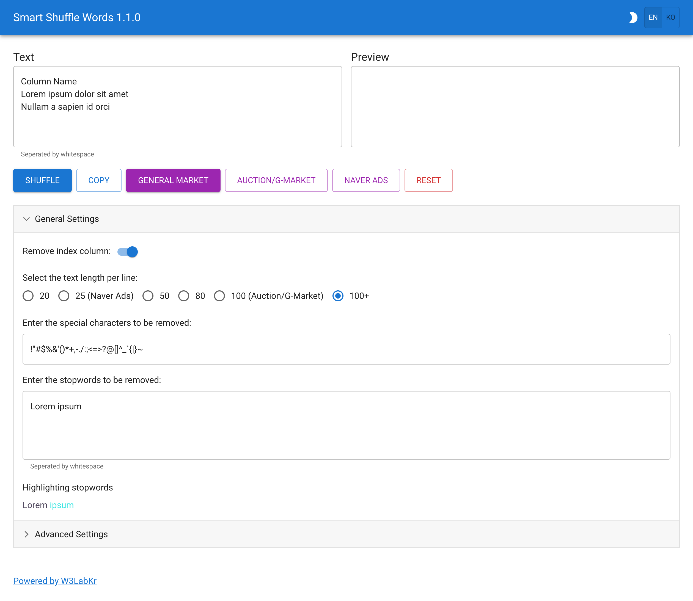

# JS Smart Shuffle Words

Shuffle the words on each line.

## Demo

Visit the [demo site](https://w3labkr.github.io/js-smart-shuffle-words/).



## Directory Structure

```text
.
`-- src/
    |-- assets/
    |   |-- css/
    |   `-- images/
    |-- components/
    |-- contexts/
    |-- hooks/
    |-- locales/
    |   |-- en/
    |   `-- ko/
    |-- modules/
    |-- pages/
    |-- resources/
    |-- store/
    |   |-- atoms/
    |   `-- selectors/
    |-- templates/
    |-- App.js
    `-- index.js
```

Directory tree generated using [tree.nathanfriend.io](https://tree.nathanfriend.io).
